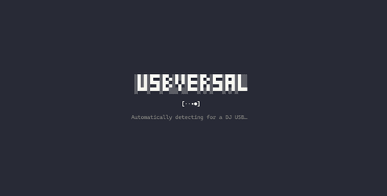
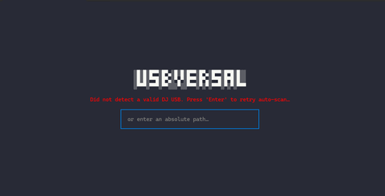
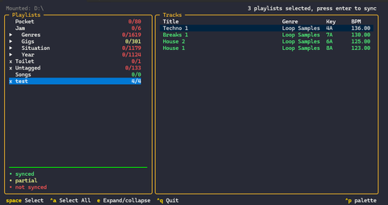
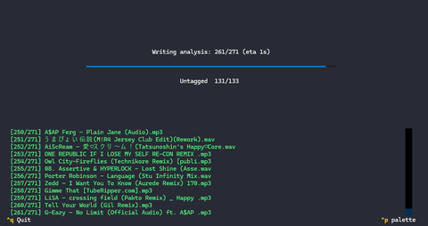
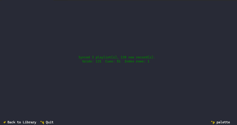

# Usbversal

Usbversal is a terminal app that copies Rekordbox playlists, beatgrids,
and hot cues onto the Serato side of the **same** USB stick.

Export the library from Rekordbox onto the stick first. Then run
usbversal, pick playlists, and sync.

## Before you start

1. In Rekordbox, export your playlists (and analysis) to the USB.
2. Mount the stick on this machine (Linux, macOS, Windows, or WSL).
3. Leave Serato closed. Do not open the stick from Serato or Explorer
   while usbversal is writing.

Usbversal only reads the Rekordbox export. It never writes under
`PIONEER/`. If a sync goes wrong, restore the Rekordbox USB.

## Using it

### On launch

Usbversal automatically looks for a Rekordbox USB.



If nothing shows up, press Enter to scan again, or type an absolute path.



### Pick playlists

Once a stick is open, playlists appear on the left and a track preview
on the right. Each playlist row is red, yellow, or green:

| Colour | Meaning |
|--------|---------|
| Red | Nothing synced |
| Yellow | Some tracks synced |
| Green | All tracks synced |

Space selects a playlist (a folder selects every playlist under it).
`Ctrl+A` selects or clears every playlist. `e` expands or collapses a
folder. Enter starts the sync when at least one playlist is selected.



### While syncing

Usbversal copies the selected playlists as Serato crates and writes
beatgrids and hot cues onto the audio files. Status, a progress bar,
and a live log update as tracks finish.



### When it finishes

You get counts (playlists, grids, cues). Failed tracks stay on screen
and also land in
`~/.local/share/usbversal/<volume>/error.log`. Enter goes back to the
playlist list so you can sync again.



Unmount the stick yourself when the sync finishes.

## How a sync works

On launch, usbversal finds the stick and reads the Rekordbox playlists.
If Serato has never seen this stick, it sets up an empty Serato library
next to the songs.

The sync writes the playlists you selected as Serato crates, nested 
under the stick name. A Rekordbox library on a volume called `MYUSB`
shows in Serato like this:

```text
MYUSB
├── Gigs
│   └── Played
└── Genres
    └── Techno
```

The songs themselves are the same files already on the stick. Usbversal
matches each track by that path, then writes the Rekordbox beatgrid,
hot cues, and cue colours onto the file. BPM and key in Serato's
library list update for tracks Serato already knows. The first time
you open the stick in Serato, Serato finishes building its own list.

A later sync updates what is already there. It does not wipe the
Serato library. If writing a file fails, the original song is put
back.

## Run it

A built release is a single file:

```bash
usbversal
```

Windows, Linux, and macOS. On launch it watches the usual
removable-media roots (`/media/$USER`, `/Volumes`, drive letters). If
it misses the stick, type the mount path, or set `USBVERSAL_MOUNT`
before launch.

## Run from source

From a checkout:

```bash
./scripts/setup-dev.sh
source .venv/bin/activate

python -m app.tui
```

`setup-dev.sh` creates `.venv` and installs the package with the
dev extras. Python 3.11 or newer.

Same app, same `USBVERSAL_MOUNT` override. Contributor setup (lint,
tests, task rules) is in [`CONTRIBUTING.md`](CONTRIBUTING.md).

## Build

A `v*` tag on `main` builds Windows, macOS, and Linux binaries. On
this machine:

```bash
./scripts/build-release.sh
```

That writes `dist/usbversal` or `dist/usbversal.exe`. See
[docs/workflows/release-workflow.md](docs/workflows/release-workflow.md).

## Contributing

Dev setup, tests, and review notes:
[`CONTRIBUTING.md`](CONTRIBUTING.md). Internals and layout:
[`ARCHITECTURE.md`](ARCHITECTURE.md).
