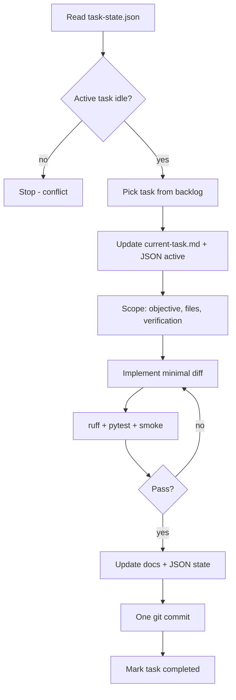

# Agent Task Workflow

Standard workflow for autonomous agents — mirrors [`AGENT.md`](../../AGENT.md).

## Flow

## Checklist

- [ ] `task-state.json` active_task set
- [ ] Scope table filled in `current-task.md`
- [ ] Only scoped files modified
- [ ] Verification log complete
- [ ] `repository-state.json` updated
- [ ] Task moved to completed history
- [ ] Single commit pushed (if remote workflow applies)

## Related

- [verification-workflow.md](verification-workflow.md)
- [../tasks/backlog.md](../tasks/backlog.md)
